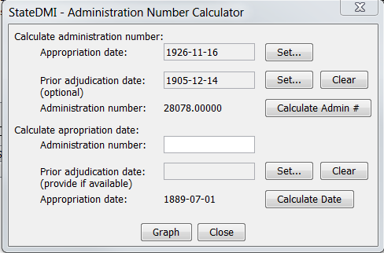
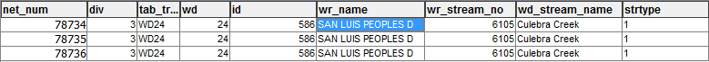
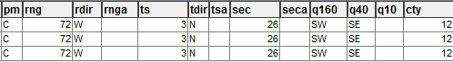
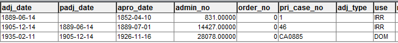
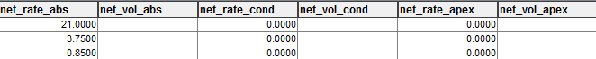
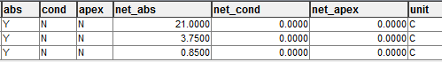
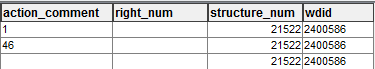

# HydroBase Primary Dataset / Water Rights #

Water rights in HydroBase are accessible by two primary database views (a view shows data from one or more tables) :

* vw_CDSS_Transact - stores individual transactions
* vw_CDSS_NetAmts - stores "net amounts", representing the cumulative effect of transactions

Transaction data correspond to a Water Court case actions, such as an original decree, change in use, abandonment, etc.
These transactions, if accumulated over time, result in a net amount that reflects all of the transactions.

Net amount water rights are typically used for analysis and modeling that are concerned with the cumulative water rights
in effect at a point in time.

Water rights data in HydroBase have the following limitations:

* Net water rights represent the cumulative effect of all transactions for the current time (or when HydroBase was distributed).
There is no time series of net amount water rights stored in HydroBase that would represent the cumulative water rights
at each point in time (for example year).  This impacts how data can be used for historical analysis.
Although the calculation of net amount rights from transactions sounds simple
and it might be tempting to create a time series of net amount rights;
however, the calculation of net amount water rights is actually quite complex
(**TODO smalers 2016-11-18 would be nice to reference DWR documentation for the algorithm by referencing online document**).
* **TODO smalers 2016-11-20 need to discuss how date of transaction is (not) coded in the database - have to look at action comments,
which are not consistent.
This makes it difficult to automate building analysis and visualization of long-running court cases.**

**TODO smalers 2016-18-20 would be good to show one or more examples of how net amount rights are calculated.**

The following resources are useful to understand HydroBase water rights datasets and water rights concepts:

* [HydroBase Data Dictionary](http://cdss.state.co.us/onlineTools/Documents/HBGuest.pdf).
* **TODO smalers 2016-11-20 need to hook in navigable HTML data dictionary, such as produced by TSTool**
* [Citizen's Guide to Colorado Water Law, CFWE](https://www.yourwatercolorado.org/cfwe-education/water-is/water-law)
* **TODO smalers 2016-18-20 need to hook in references to Andrew Jones' book, other resources**

The following sections provide additional background on water right data definitions
for transaction and net amount water rights.

## Water Right Terminology and Definitions ##

Before describing data examples using HydroBase data, it is helpful to define a few terms, which will be used in the data example narrative.
The terms are listed in alphabetical order below to serve as a reference.
However, conceptually, it is helpful to read the definitions in the following order:

* **Location** - understand how rights are tied to a Structure location
	+ [Water District Identifier (WDID)](#water-district-identifier-wdid)
	+ **TODO smalers, 2016-18-20 need to discuss alternate points and exchanges**
* **Water Source** - understand what water body the water is taken from
	+ [Water Source](#water-source)
* **Priority Date** - understand how dates are handled to determine a priority
	+ [Appropriation, Adjudication, and Previous Adjudication Dates](#appropriation-adjudication-and-previous-adjudication-dates) - dates
	for beneficial use and court approval of right
	+ [Administration Number](#administration-number) - a number that facilitates sorting water right priorities for analysis and modeling
	+ [Absolute and Conditional Rights](#absolute-and-conditional-rights) - indicate whether water right can be used now, or a placeholder for future development
	+ [Order Number](#order-number) - an additional number that defines priority order, when a tie-breaker is needed
* **Use** - understand the use type that a decree allows
	+ [Use](#use) - the use(s) that a decree allows
* **Amount** - understand the amount of the decree
	+ **TODO smalers 2016-18-20 need to discuss decree, especially for diversions, wells, reservoirs, instream flow, etc.**
	+ [Units](#units) - the data units for the decree

See also the following important concepts:

* [Unique Identifier](#unique-identifier)

### Absolute and Conditional Rights ###

Water rights can be conditional or absolute.  A conditional water right can be thought of as an intent to develop water but it has not yet been developed
and put to beneficial use.  Examples are storage rights for reservoirs that have not been built, and for industries like oil shale that have not
been built.  The conditional right keeps the right-holder's place in the priority timeline.
Conditional rights cannot be kept indefinitely without the right-holder making some progress such as demonstrating that the
intended project is still realistic and financial resources continue to be applied.

An absolute right is one where the right has been put to beneficial use, recognized by the water court.
Absolute rights can be lost (abandoned) if they are not used as intended.

**TODO smalers 2016-11-18 need to add references to authoritative definitions.**

### Administration Number ###

The administration number numerically combines the appropriation date and previous adjudication date to calculate
a single number that can be used in analysis and modeling.
The administration number is a number with decimal part that always has five digits on the right side, for example `.12345`.
From the HydroBase data dictionary:

* *A calculated number developed by the Division of Water Resources to
provide a simple and efficient method of ranking decrees in order of
seniority. Computed as follow:*

* *If the appropriation date is later than the previous adjudication
date, then the left side is the number of days between
12/31/1849 and the appropriation date, and the right side is
zero (.00000)*
* *If the appropriation date is the same as, or earlier than, the
previous adjudication date, then the left side is the number of
days between 12/31/1849 and the previous adjudication date,
and the right side is the number of days between 12/31/1849
and the appropriation date.*

The administration number is used by StateMod to rank water rights when making allocation decisions in the simulation.
Other modeling tools such as the MODSIM modeling software might use this number as input to a network solver,
for example to weight how decisions are made.

The StateDMI and StateView software provides a useful tool under the ***Tools / Administration Number Calculator***, which allows
conversion between dates and administration number.




### Appropriation, Adjudication, and Previous Adjudication Dates ###

The *appropriation date* corresponds to the date of proven beneficial use.
Old rights may have been assigned an appropriation date after the fact based on demonstrated application of the water,
because water court did not convene regularly.
From the HydroBase data dictionary:

*The date that can be proven in a court of law from
which there was an open overt act upon the land to demonstrate an
intent to apply water for beneficial use and as awarded in the decree.*

The *adjudication date* is the date when water court awarded the water right decree.
From the HydroBase data dictionary:

*Adjudication date is the date that the water right was settled by judicial
procedure, i.e. date that the court awarded a water right.*

* *Pre-1969 adjudications: The date is the day the Judge signed
the decree.*
* *Post-1969 adjudications: The date is the last day of the year of
filing.*

The *previous adjudication date* (sometimes called *prior adjudication date*) allows refinement to the priority ordering to reflect
an earlier adjudication process for the water right.
This is used to compute the *administration number* (see below).
From the HydroBase data dictionary:

* *The previous adjudication date field allows water rights to be ordered by
priority with all rights awarded subsequent to a previous adjudication being
junior to those previously awarded regardless of their appropriation dates.*
* *Original adjudication: There is no previous adjudication date and
thus this field is blank.*
* *Pre-1969 adjudications: The previous adjudication date is the
date of the proceeding general adjudication.*
* *Post-1969 adjudications: The previous date is the last day of the
proceeding year.*

Multiple water rights can be decreed for the same Structure, each with different dates.
For example, a ditch might have an original senior water right, and a more junior water right that was applied for at a later date
when more acreage was developed.

### Order Number ###

The order number is a simple integer that is used as a tie breaker when all other priority information for a water right result in the same
priority.  From the HydroBase data dictonary:

*An order number may be assigned to distinguish decrees with identical
dates but have been decreed to have specifically different priorities.*

The order number in HydroBase is nearly always 0.  The following query will list all water rights in HydroBase with non-zero order number.

```sql
select * from vw_cdss_netamts where order_no != 0

```

The above actually returns 3578 rights (163774 total rights) at the time of this documentation.

**TODO smalers 2016-11-20 Need to expand the above, for example listing non-zero order number by water district and explain
some concreate examples of when order number is used.**

### Unique Identifier ###

To uniquely identify a water right requires using the following data parts.
Multiple water rights with different priority dates can be associated with one structure,
in particular large structures that serve many water users.

* The Structure WDID provides the unique identifier for the location.
* The administration number provides the unique identifier for the priority date suitable for sorting water right priorities
(combines appropriation date and previous adjudication date).
* The units uniquely identifies flow versus storage decree.
* The order number provides a way to uniquely identify water rights when other data fields are duplicated.

Consequently, to uniquely identify water rights for analysis or modeling, the above data must be used in the water right identifier.

In actuality, model data files such as for StateMod do not have slots for all of the above, in particular `order`, and
therefore software must pre-process data into model formats.
One challenge for StateMod as currently implemented is that water right identifiers are limited to 12 characters
(**TODO smalers 2016-11-20 need to remove this limitation with software enhancements.**).
For example reservoir rights use acft units and are stored in one file and diversion rights using cfs units are stored in a different file;
therefore, there is not a need to have units the model identifiers.
The StateDMI CDSS software is used to create StateMod data files and addresses mapping HydroBase data to StateMod files.

### Units ###

The data units for water rights indicate how the water right decree amount is measured.  For example, a diversion right off of a river is typically 
measured in cubic feet per second (cfs).  A storage right for a reservoir is typically measured in acre-feet (acft).
Other units may be used in a water right decree (such as gallons per minute for well) but only cfs and acft units are typically stored in
HydroBase water right tables.

**TODO smalers 2016-11-20 need to explain with some examples.**

### Use ###

**TODO smalers 2016-11-18 need to describe and link to diversion record coding.**

### Water District Identifier (WDID) ###

Each Water Right must be assigned to a Structure that has a physical location.
Each Structure has a "water district identifier" or WDID.
Water districts correspond to river basins and have numbers (**TODO smalers 2016-11-18 need to describe districts and divisions somewhere**).
Many HydroBase data tables include `wd`, `id`, and/or `wdid` columns corresponding to Structure WDID.

The WDID is comprised of a two-digit, zero-padded water district, and a 5-digit, zero-padded structure identifier.
For example, WDID `0100501` is the WDID for `Empire Ditch`, Structure `501` in Water District 1 (`South Platte:  Greeley to Balzac`).
The Structure WDID is the unique identifier for the Structure and guarantees that associated data can be found in HydroBase,
whereas the Structure name is not unique (for example `Smith Ditch`).

The significance of the identifier is historical.  In the past diversion headgate Structures were typically numbered 500+, reservoirs 3000+, etc.,
in order to help identify and sort Structures by type.
However, this convention is no longer strictly followed or needed with modern databases.

The WDID is often used in CDSS modeling, including identifying Structures in model datasets.

Note that HydroBase tables also will contain columns like `structure_num` which is an internal database identifier.
These columns can be used to relate tables, but should never be used in human-facing datasets such as for modeling.

### Water Source ###

The Water Right has a water source.  In the days before geographic information systems (GIS), the source corresponded to a stream name written on a paper map,
and the data might not be very accurate.
However, as GIS and database technologies have advanced, the accuracy of and use of the water source assigned to water rights has improved.

It is helpful to use the water source in modeling.  However, StateMod and StateCU input files do not typically have a place for such data.
Instead, the water district, which is part of Structure and Water Right identifiers, provides a clue to the water source to a Water District level
(e.g., a Structure WDID of 
**TODO smalers 2016-11-18 this could be improved in model data files.**

A challenge with water sources is that names of water features are not unique since there are duplicate names like `Muddy Creek`,
`Spring Creek`, etc.

**TODO smalers 2016-11-18 need to discuss the `wd_stream_name` in HydroBase and the Source Water Route Framework layer, which uses unique identifiers from USGS NHD dataset**.

## Transaction Water Right Examples ##

**TODO smalers 2018-11-18 need to fill in**

## Net Amount Water Rights Examples ##

These examples illustrate the Net Amount water right dataset.

### Oldest Water Right in Colorado ###

This right can be queried from HydroBase with the following SQL statement (for example using TSTool ReadTableFromDataStore command).

```sql
select * from vw_cdss_netamts where wr_name like '%peoples%' and div = 3
```

The above returns 3 Net Amount Water Rights for the same structure, with the following being primary data:

```
# One structure returned...
wd = 24
id = 586
wdid = 2400586
wr_name = SAN LUIS PEOPLES D
wd_stream_name = Culebra Creek

# Three net amount rights are returned, listed separately below...

# First...
adj_date = 1889-06-14
padj_date =
apro_date = 1852-04-10
admin_no = 831.00000
order = 0
absolute amount decree = 21 cfs

# Second...
adj_date = 1905-12-14
padj_date = 1889-06-14
apro_date = 1889-07-01
admin_no = 14427.00000
order = 0
absolute amount decree = 3.75 cfs

# Third...
adj_date = 1935-02-11
padj_date = 1905-12-14
apro_date = 1926-11-16
admin_no = 28078.00000
order = 0
absolute amount decree = .85 cfs

```
The output from TSTool is as follows (splitting the wide table into sections to view all data together):

.
.
.
.
.
.

**TODO smalers 2018-11-20 Need to enhanced TSTool to reformat rows as list of properties, for use in documentation**

**TODO smalers 2018-11-20 Need to do screen shot of HydroBase web interface and explain steps to get there**
